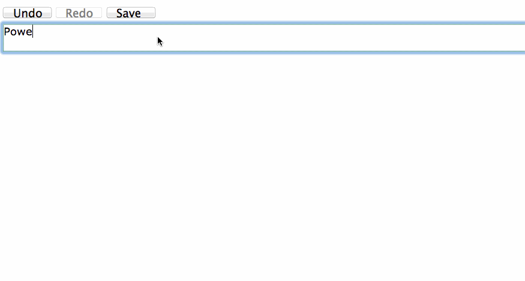

undo-experiments
================

Experiments with Mutation Observers vs. Object.observe(). Best tested in Chrome 36 beta +.

The basic idea is that we have a `contentEditable` area of which we would like to track all edits made such to enable Undo/Redo. 

In the MO case, we're purely observing the DOM for changes and adding records to a change stack based on user edits. In the O.o case, we start off with an empty "model" (bound to our template) which we observe and then update whenever the user edits the content. The change records are added to the stack as part of the observer callback.

I'm trying to understand which of these primitives makes more sense to use for this particular use-case.

__In action:__

